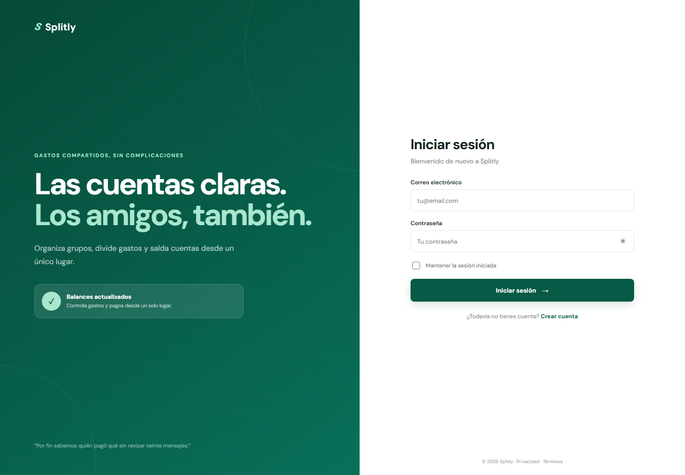

# Splitly

Aplicación web para organizar gastos compartidos, repartir importes y mantener claros los saldos entre amigos, parejas o equipos.

Splitly permite crear grupos, invitar participantes, registrar quién pagó cada gasto y consultar cuánto debe cada persona desde una interfaz responsive. Está desarrollado sin frameworks, con especial atención a la seguridad, la privacidad y la experiencia móvil.

<p align="center">
  <a href="https://splitly.freire-sanchez-valencia.es/"><strong>Ver demo en vivo →</strong></a>
</p>

## Captura



## Funcionalidades

- Registro, inicio y recuperación de cuenta con contraseñas protegidas mediante `password_hash`.
- Sesión persistente opcional mediante tokens almacenados únicamente como hash.
- Creación y eliminación segura de grupos por parte de su propietario.
- Búsqueda privada de usuarios por correo o nombre completo exacto.
- Invitaciones que pueden aceptarse o rechazarse desde las notificaciones.
- Avisos para integrantes existentes e invitaciones pendientes.
- Registro, edición y eliminación de gastos.
- División equitativa opcional o asignación exclusiva al pagador.
- Cálculo de balances y propuesta de liquidaciones.
- Historial de actividad, estadísticas y gráficos interactivos.
- Preferencias de notificaciones por usuario.
- API autenticada para registrar gastos desde Atajos de iOS y Siri.
- Diseño responsive para escritorio, tablet y móvil.

## Tecnologías

| Área | Tecnología |
| --- | --- |
| Backend | PHP 8.1+ y endpoints JSON |
| Base de datos | MySQL 8, vistas, índices y claves foráneas |
| Acceso a datos | PDO, consultas preparadas y transacciones |
| Frontend | HTML5, CSS3 y JavaScript Vanilla |
| Gráficos | Chart.js 4.5 incluido localmente |
| Seguridad | CSRF, cookies `HttpOnly`, `SameSite`, rate limiting y tokens SHA-256 |

No requiere Composer, Node.js ni un proceso de compilación.

## Demo

La versión publicada está disponible en [splitly.freire-sanchez-valencia.es](https://splitly.freire-sanchez-valencia.es/).

## Instalación local

### Requisitos

- PHP 8.1 o superior con PDO MySQL y mbstring.
- MySQL 8.0 o superior.
- Apache, Laragon o el servidor integrado de PHP.

### Con Laragon

1. Clona el repositorio dentro de `C:\laragon\www`:

   ```bash
   git clone https://github.com/Danielcreux/Splitly_gastos.git
   ```

2. Crea una base de datos vacía llamada `splitly`.
3. Provisiona el esquema MySQL del proyecto. La carpeta local `database/` no se distribuye en este repositorio.
4. Inicia Apache y MySQL desde Laragon.
5. Abre [http://localhost/Splitly_gastos/](http://localhost/Splitly_gastos/) y crea tu primera cuenta.

La configuración local predeterminada usa `127.0.0.1`, base `splitly`, usuario `root` y contraseña vacía.

También puedes iniciar la aplicación desde su directorio con:

```bash
php -S localhost:8000
```

## Configuración

La aplicación recibe su configuración mediante variables de entorno. Consulta [`.env.example`](.env.example):

```env
APP_ENV=production
APP_URL=https://tu-dominio.com
TRUST_PROXY=false
FEATURE_PASSWORD_RESET=false

DB_HOST=127.0.0.1
DB_PORT=3306
DB_NAME=splitly
DB_USER=splitly_app
DB_PASS=una-clave-segura
```

PHP debe recibir estas variables desde el servidor o proveedor de alojamiento; el proyecto no carga archivos `.env` automáticamente.

## Atajo de iOS

Splitly permite crear desde **Configuración** un token revocable para registrar gastos mediante Atajos o Siri. El token se solicita en la primera ejecución y puede conservarse en iCloud Drive para no volver a pedirlo.

Consulta [la guía de configuración del Atajo](docs/atajo-ios.md) para construir el flujo y conocer el contrato JSON de la API.

## Arquitectura

```text
Splitly/
├── api/                 Endpoints JSON de autenticación y operaciones
├── assets/              Estilos, JavaScript y Chart.js
├── config/              Sesión, base de datos y configuración
├── includes/            Componentes PHP compartidos
├── src/                 Servicios, repositorios y balances
├── views/               Vistas de cada módulo
└── index.php            Punto de entrada
```

El frontend consume los endpoints mediante `fetch`. Las operaciones sensibles se validan nuevamente en el servidor y las escrituras relacionadas se ejecutan dentro de transacciones.

## Seguridad

- Consultas preparadas con PDO.
- Protección CSRF en operaciones de escritura.
- Cookies de sesión `HttpOnly` y `SameSite=Lax`.
- Tokens persistentes y de recuperación almacenados como hash.
- Regeneración del identificador de sesión después de autenticar.
- Límites de intentos de acceso y búsquedas de usuarios.
- Permisos verificados en servidor para grupos, gastos y liquidaciones.
- Reglas de Apache para proteger recursos internos.

## Despliegue

1. Configura `APP_ENV=production` y una `APP_URL` HTTPS válida.
2. Usa un usuario MySQL exclusivo y evita utilizar `root`.
3. Provisiona el esquema MySQL privado y sus migraciones.
4. Activa la recuperación de contraseña únicamente al disponer de correo real.
5. Mantén `display_errors=Off` y `log_errors=On`.

## Autor

Proyecto full-stack desarrollado para demostrar diseño de producto, modelado de datos, seguridad web y desarrollo responsive sin frameworks.
